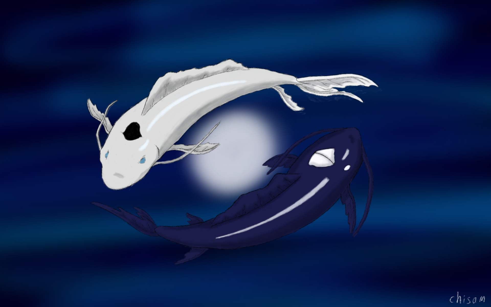

# Koi-fishes-in-OpenGL
The project represents animated models of koi fish inspired by the animation "Avatar: The Last Airbender"

## Expectations




## Results:


## Motivation and Project Description
This project was developed as part of the "Computer Graphics" course for the final assessment. The central concept involves the animation of fish models orbiting around the moon, which serves as the light source and rotates counter to the movement of the fishes.

To bring my vision to life, I utilized existing solutions such as the universe, moon, and koi carp models. However, I modified textures, ensuring a close resemblance to the koi carps featured in the animation. 
Furthermore, I personally implemented the movement of the models, the lighting effects and the camera control.

## Installation
To launch my program I recommend you to do this via "Visual studio". After downloading the files from this repository, locate the "KoiFishes.sln" file in the "Code" folder and run it. The code, along with the necessary libraries, should be ready to run. 

However, during the project startup, an error related to model loading may occur. Despite this error, the program should launch after pressing the "Continue" button three times.

## Code Listing
### Libraries:
The project utilizes the following libraries:

- **OpenGL** – a graphics library
- **GLFW** – a library enabling window, context, keyboard, and mouse management for OpenGL
- **GLEW** – a library assisting in querying and loading OpenGL extensions
- **GLM** – a mathematical library
- **STB** - a library allowing for texture usage

### Models:

#### Universe:
The universe inside which the remaining models are located is actually a cube, shaped with 12 triangles:

```C++
float skyboxVertices[] =
{
	-1.0f, -1.0f,  1.0f,
	 1.0f, -1.0f,  1.0f,
	 1.0f, -1.0f, -1.0f,
	-1.0f, -1.0f, -1.0f,
	-1.0f,  1.0f,  1.0f,
	 1.0f,  1.0f,  1.0f,
	 1.0f,  1.0f, -1.0f,
	-1.0f,  1.0f, -1.0f
};

unsigned int skyboxIndices[] =
{
	// Prawa
	1, 2, 6,
	6, 5, 1,
	// Lewa
	0, 4, 7,
	7, 3, 0,
	// Górna
	4, 5, 6,
	6, 7, 4,
	// Dolna
	0, 3, 2,
	2, 1, 0,
	// Tylna
	0, 1, 5,
	5, 4, 0,
	// Przednia
	3, 7, 6,
	6, 2, 3
};
```
#### Moon and fish models:
The moon is a sphere model on which an appropriate texture is applied. Both koi fish use the same model, but have different textures. The mentioned models are loaded
from outside the program, using files in the ".gltf" format.

```C++
std::string parentDir = (fs::current_path().fs::path::parent_path()).string();
std::string laPath = "/Resources/models/tui/scene.gltf";
std::string tuiPath = "/Resources/models/la/scene.gltf";
std::string moonPath = "/Resources/models/moon/scene.gltf";

Model tui((parentDir + tuiPath).c_str());
Model la((parentDir + laPath).c_str());
Model moon((parentDir + moonPath).c_str());
```

#### Camera control:
Camera control is implemented using the "Camera.h" and "Camera.cpp" libraries, which contain methods responsible for interpreting the corresponding key inputs.

In the project, movement is possible using the following keys:
- **W** – camera moves forward
- **A** – camera moves left
- **S** – camera moves backward
- **D** – camera moves right
- **SHIFT** – accelerated camera movement
- **SPACE** – camera moves upward
- **CONTROL** – camera moves downward
- **Left Mouse Button** – freely rotates the camera.

#### Lighting:
Projekt wykorzystuje trzy źródła światła
- **SkyboxShader** - responsible for uniform lighting on all sides of the cube representing the universe.
- **ShaderProgram** - enables illumination of fish from the inside.
- **ShaderMoon** - responsible for uniform lighting across the entire surface of the moon.

```C++
Shader shaderProgram("default.vert", "default.frag");
Shader skyboxShader("skybox.vert", "skybox.frag");
Shader shaderMoon("moon.vert", "moon.frag");

glm::vec4 lightColor = glm::vec4(1.0f, 1.0f, 1.0f, 1.0f);
glm::vec3 lightPos = glm::vec3(0.0f, 5.0f, 0.0f);

shaderProgram.Activate();
glUniform4f(glGetUniformLocation(shaderProgram.ID, "lightColor"), lightColor.x, lightColor.y, lightColor.z, lightColor.w);
glUniform3f(glGetUniformLocation(shaderProgram.ID, "lightPos"), lightPos.x, lightPos.y, lightPos.z);
skyboxShader.Activate();
glUniform1i(glGetUniformLocation(skyboxShader.ID, "skybox"), 0);
shaderMoon.Activate();
glUniform4f(glGetUniformLocation(shaderMoon.ID, "lightColor"), lightColor.x, lightColor.y, lightColor.z, lightColor.w);
glUniform3f(glGetUniformLocation(shaderMoon.ID, "lightPos"), lightPos.x, lightPos.y, lightPos.z);
```

#### Model Movement:
Circular movement of the fish with a specified radius:

To implement this type of object movement, I utilized trigonometric functions, enabling the determination of the object's position at a given moment on the circle.

Rotation of the model around its own axis:

For the implementation of model rotation around its axis, I employed the "angleAxis()" function, found in the "mesh.cpp" library. This function constructs a quaternion from the rotation angle and the vector specifying the rotation axis. Subsequently, the quaternion is passed to the "Draw()" function.

Both forms of movement use the same variable, determining the increasing value of the angle. This allows for synchronizing simultaneous rotation of the models with their circular movement. With a change in position on the circle by an angle equal to α, the model must also rotate by α degrees, ensuring that the model remains rotated in the same way relative to the center of the circle.

```C++
float movement = 0.0, radius = 355.0;
glm::quat rotation_koi;
glm::quat rotation_moon;
```

```C++
rotation_koi = glm::angleAxis(movement, glm::vec3(0.0f, 1.0f, 0.0f));
rotation_moon = glm::angleAxis(movement, glm::vec3(0.0f, -1.0f, 0.0f));

tui.Draw(shaderProgram, camera, glm::vec3(radius * sin(movement), 0.0f, radius * cos(movement)), glm::vec3(26.0f, 26.0f, 26.0f), rotation_koi);
la.Draw(shaderProgram, camera, glm::vec3(radius * sin(M_PI + movement), 0.0f, radius * cos(M_PI + movement)), glm::vec3(-26.0f, 26.0f, -26.0f), rotation_koi);
moon.Draw(shaderMoon, camera, glm::vec3(0.0f, 5.0f, 0.0f), glm::vec3(3.0f, 3.0f, 3.0f), rotation_moon);

movement += glm::radians(0.05f);
```


